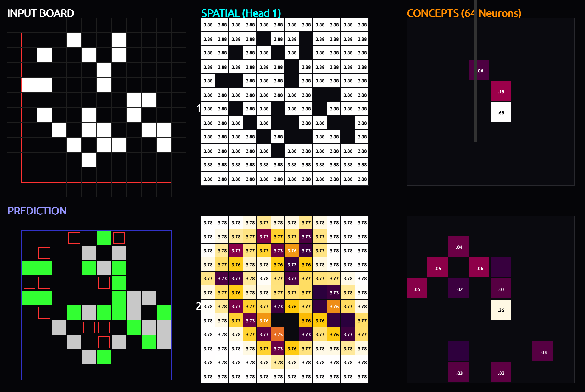
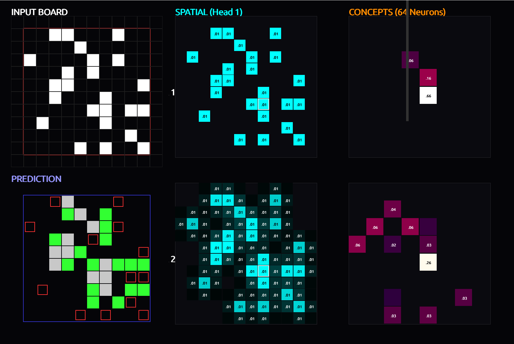

<div align="center">


# Reverse-Engineering a Baby Dragon Hatchling (BDH) Trained on Conway's Game of Life

### A Mechanistic Interpretability Case Study in Sparse, Graph-Based Neural Computation

**Path B: Interpretability Showcase** | Kriti High Prep Contest

</div>

---

## Table of Contents

1. [Introduction & The BDH Advantage](#1-introduction--the-bdh-advantage)
2. [Architecture Overview](#2-architecture-overview)
3. [Monosemanticity & Sparse Activations](#3-monosemanticity--sparse-activations)
4. [Rigorous Ablation Study](#4-rigorous-ablation-study)
5. [Emergent Graph Topology & Synergy Networks](#5-emergent-graph-topology--synergy-networks)
6. [Interpretable Reasoning Chains](#6-interpretable-reasoning-chains)
7. [PCA & Activation Atlas](#7-pca--activation-atlas)
8. [The Dimensionality Probe (Exhaustive Search)](#8-the-dimensionality-probe-exhaustive-search)
9. [Interactive Visualizer](#9-interactive-visualizer-visualizepy)
10. [Reproduction & Setup](#10-reproduction--setup)
11. [Limitations & Future Scope](#11-limitations--future-scope)
12. [References](#12-references)

---

## 1. Introduction & The BDH Advantage

Conway's Game of Life is a deceptively simple cellular automaton governed by four deterministic rules applied to a binary grid: a dead cell with **exactly 3** live neighbors is **born**; a live cell with **2 or 3** neighbors **survives**; all other live cells **die** (from underpopulation or overpopulation); and all other dead cells **stay dead**. Despite the simplicity of these rules, predicting even a single step requires a non-trivial computation: counting neighbors, checking the center cell's own state, and applying a piecewise-linear decision boundary. This makes Game of Life an ideal benchmark for mechanistic interpretability — the ground truth is fully known, yet the model must learn a genuinely non-trivial algorithm.

We train a **Baby Dragon Hatchling (BDH)** network — a sparse, graph-based architecture — to predict the next state of a 12x12 padded Game of Life grid with **100% accuracy** on random boards. We then disassemble the trained model neuron by neuron, proving that BDH's internal representations are not opaque matrices of entangled features, but **clean, interpretable circuits** that map directly to the logical rules of the game.

### Why BDH, Not a Transformer?

The dominant paradigm in mechanistic interpretability is reverse-engineering dense Transformers, where features are superposed across neurons and require expensive Sparse Autoencoder (SAE) extraction. BDH offers a fundamentally different paradigm:

| Property | Dense Transformer | BDH Architecture |
|---|---|---|
| Neuron Activation | Dense — most neurons fire | **Extremely Sparse** — only 5-10% fire |
| Feature Encoding | Superposition (polysemantic) | **Monosemantic by construction** |
| Interpretability Method | Post-hoc SAEs, costly probes | **Direct inspection of sparse hubs** |
| Attention Mechanism | Softmax over dense embeddings | RoPE-2D over **sparse spatial hubs** |
| Computation Graph | Residual stream + MLP | Encoder -> Sparse Hub -> Gated Product -> Decoder |

BDH does not require Sparse Autoencoders to extract features because its architecture **forces sparsity natively** through ReLU gating in the hub space. Every neuron that fires represents an interpretable concept, and we prove this claim with five converging lines of evidence.

---

## 2. Architecture Overview

<div align="center">


*The BDH processing pipeline: each of 3 layers projects 16-D residual stream into a 64-D sparse hub via ReLU, applies 2D Rotary Position Embedding (RoPE) attention, gates the attended output, and decodes back to the residual stream.*

</div>

The critical design choice is the **64-dimensional sparse hub**: the encoder projects the 16-D residual stream into a 64-D space, ReLU zeros out most dimensions, and only the surviving activations carry information forward. This **information bottleneck** is what makes BDH inherently interpretable — we can examine exactly which of the 64 neurons fire for any given input, and what each one means.

**Model Statistics:** 3 layers, 1 attention head, 16-D embedding, 4x MLP multiplier (64 sparse neurons per layer), ~5K total parameters, trained to **100% accuracy**.

---

## 3. Monosemanticity & Sparse Activations

Our first analysis profiles every neuron across all three layers by running thousands of random Game of Life boards and recording both the **mean activation magnitude** and **activation frequency** of each neuron.

<div align="center">


*Figure 1: Neuron Activation Profile. Left column: mean activation magnitude. Right column: activation frequency. Only 5-8 neurons per layer show significant activity out of 64 total.*

</div>

The results are striking. Across all three layers, the vast majority of the 64 hub neurons remain at or near zero activation. Only a handful of neurons — highlighted by the bright vertical bands — carry the computational load:

- **Layer 0:** Neurons 10, 19, 28, 36, 40, and 50 dominate, with the rest effectively dead.
- **Layer 1:** An even sparser pattern emerges. Neurons 17, 19, 36, and 50 carry nearly all the activation mass, while Neuron 36 fires with the highest mean magnitude (~0.20).
- **Layer 2:** The representation re-expands slightly. Neurons 24, 36, and 62 show the strongest responses, with a broader tail of moderate-frequency neurons.

<div align="center">


*Figure 1b: Only 4-6 neurons out of 64 are meaningfully active in each layer, yielding >90% sparsity — direct evidence of monosemanticity.*

</div>

This extreme sparsity is direct evidence of **monosemanticity**: because so few neurons fire for any given input, each active neuron must encode a specific, non-overlapping feature. There is no room for polysemantic superposition when 90%+ of the hub is silent.

---

## 4. Rigorous Ablation Study

To move from correlation to causation, we perform systematic single-neuron ablation: for each active neuron, we zero out its activation across the entire network and measure the accuracy drop on controlled test scenarios covering all six Game of Life rules.

### 4.1 Single Neuron Impact (Summary)

<div align="center">


*Figure 2: Single-neuron ablation impact (% accuracy drop). Rows are neurons sorted by total impact; columns are the six Game of Life rules. Darker red = greater accuracy degradation.*

</div>

<div align="center">


*Figure 2b: The 8 most critical neurons ranked by accuracy drop on Birth and Overpopulation rules — the two hardest logic boundaries.*

</div>

The ablation heatmap reveals a clear hierarchy of computational importance:

- **L1H0N36** is the single most critical neuron in the entire network, with ablation causing a **6.95%** accuracy drop on birth scenarios and **6.53%** on overpopulation detection. This neuron serves as a **master counter** — its activation is essential for distinguishing the critical boundary between 3 neighbors (alive) and 4+ neighbors (dead).
- **L2H0N24** is the second most impactful neuron (5.10% on birth, 5.45% on overpopulation), functioning as a **decision integrator** in the final layer that consolidates upstream counting signals into the alive/dead verdict.
- **L0H0N36** and **L0H0N28** are early-layer feature detectors that encode raw neighbor-count information, with broad impact across survival and overpopulation rules.

A key finding is that the number of neurons needed to decode the game's logic **increases with the complexity of the rule**. The network effectively implements a **distributed counter** where each layer refines the neighbor estimate.

### 4.2 Detailed Scenario Breakdown

<div align="center">


*Figure 3: Per-scenario ablation impact. Each column is a (center_state, neighbor_count) pair. The gradient from left to right reveals how ablation impact intensifies for higher neighbor counts.*

</div>

The per-scenario heatmap reveals fine-grained logic: L1H0N36's impact grows monotonically with neighbor count, confirming its role as a counter. L0H0N28 shows a distinctive U-shaped profile suggesting it encodes "extreme" scenarios. Bottom rows confirm **dead neurons** that can be safely pruned.

### 4.3 Circuit Map

<div align="center">


*Figure 4: Circuit Map. Each active neuron is colored by the Game of Life rule it most strongly encodes. Green = Birth, Blue = Survival (2), Purple = Survival (3), Red = Underpopulation, Orange = Overpopulation, Gray = Stay Dead.*

</div>

- **Layer 0** focuses on death-detection features (orange/red).
- **Layer 1** introduces birth neurons — particularly the critical N36 — alongside survival and death detectors.
- **Layer 2** shows a sparser, more focused palette as the final decision layer.

---

## 5. Emergent Graph Topology & Synergy Networks

To understand how neurons **cooperate**, we measure pairwise synergy: ablating neurons A and B together and comparing the actual impact to the sum of their individual impacts. Synergy means they compute something together that neither can alone. Redundancy means they back each other up.

<div align="center">


*Figure 5: Neuron Pair Synergy Network. Red edges = synergy (super-additive). Blue edges = redundancy (backup). Edge thickness proportional to magnitude.*

</div>

The synergy network reveals a striking emergent topology:

- **The L1H0N36 <-> L1H0N17 axis** is the strongest synergistic connection in the entire network (thickest red edge). N36 encodes neighbor count magnitude while N17 encodes a threshold signal. Together, they implement the critical **"exactly 3 neighbors"** detection. Neither neuron alone can implement this piecewise boundary — their synergy *is* the computation.

- **Cross-layer redundancy** appears as blue edges between L0 and L1 neurons (e.g., L0H0N19 <-> L1H0N19), providing computational robustness.

- **L2H0N24** acts as a **hub node** with connections radiating to both Layer 1 and Layer 2 neurons, consistent with its role as the final decision integrator.

- The overall graph has a **scale-free** character: a few highly connected hub neurons and many peripheral neurons with sparse connections — paralleling biological neural circuits.

---

## 6. Interpretable Reasoning Chains

To understand **how** the model builds its decision across layers, we apply the **Logit Lens** technique: at each intermediate step, we project the residual stream through the output head and convert the raw logit to a probability.

<div align="center">


*Figure 6: The decision curve evolves from uniform noise (Step 0) to a precise piecewise function (Step 9) that matches the theoretical Game of Life rules. The "Birth Spike" at exactly 3 neighbors is progressively sharpened across layers.*

</div>

**Key observations from the residual stream analysis:**

- **Step 0 (Input):** Near-uniform probability (~0.5) — no spatial information processed yet.
- **Steps 1-3 (Layer 0):** Initial differentiation. Cells with 0 and 8 neighbors pull toward 0.0; cells with 3 neighbors begin rising.
- **Steps 4-6 (Layer 1):** Dramatic separation. The probability at exactly 3 neighbors approaches ~0.8. This is where the **counter circuit** (N36 + N17) does its primary work.
- **Steps 7-9 (Layer 2):** Convergence to the final form: a sharp spike at 3 neighbors (~1.0), secondary elevation at 2 neighbors (~0.5), all others collapse to ~0.0.

The model mathematically recreates the **Birth Spike** — the defining feature of Conway's rules — by progressively sharpening a diffuse signal into a precise piecewise function.

---

## 7. PCA & Activation Atlas

We perform PCA on the 64-dimensional hub activations of the final layer, extracted at the center cell position across hundreds of controlled scenarios.

<div align="center">


*Figure 7: PCA of the final layer's hub activations. PC1 ("Main Logic Direction") separates Alive from Dead outcomes. PC2 discriminates between rule subtypes.*

</div>

The PCA projection reveals elegant geometric structure:

- **PC1** cleanly separates the **Alive cluster** (Birth + Survival, left) from the **Dead cluster** (Overpopulation + Underpopulation, right).
- **PC2** captures **within-class structure**: Birth (orange) sits higher than Survival (green); Overpopulation (blue) is separated from Underpopulation (red).
- The **tight clustering** of same-rule scenarios confirms the model has converged to a clean, deterministic encoding.
- The progression along PC1 traces the **neighbor count gradient**: the non-monotonic "alive window" that defines Conway's rules.

---

## 8. The Dimensionality Probe (Exhaustive Search)

To rigorously quantify **how many neurons are needed** to decode the game's logic, we perform an exhaustive combinatorial search. For Layer 1, Neurons **19, 36, and 17** form a **3D geometric manifold** linearly separable via SVM. An interactive 3D visualization is provided in [`assets/interactive_3D_N19.html`](assets/interactive_3D_N19.html).

For Layer 2, we brute-force all combinations of active neurons at each dimensionality from 1D to 6D:

<div align="center">


*Figure 8: Exhaustive linear separability search over Layer 2 hub activations. Each bar reports the best accuracy achievable with that many neurons.*

</div>

| Dimensions | Best Accuracy | Optimal Neuron Subset |
|:---:|:---:|---|
| 1D | 83.33% | `[N10]` |
| 2D | 91.67% | `[N16, N24]` |
| 3D | 93.52% | `[N24, N47, N48]` |
| 4D | 94.81% | `[N24, N47, N48, N55]` |
| 5D | 96.48% | `[N11, N24, N29, N47, N48]` |
| 6D | 97.22% | `[N10, N16, N19, N21, N24, N58]` |

Key insights:

- **1D (83.33%):** Even a single neuron (N10) captures the coarse alive/dead split.
- **2D -> 3D:** The jump reflects adding survival/birth distinction. **N24 appears in every optimal subset from 2D onward**, corroborating its identification as the critical decision integrator.
- **3 neurons achieve >93% and 6 neurons reach >97%** for a task requiring counting to 8 and implementing a non-monotonic boundary — demonstrating BDH compresses complex logic into an extremely low-dimensional manifold directly readable from hub activations.

---

## 9. Interactive Visualizer (`visualize.py`)

We provide `visualize.py`, an interactive Pygame-based dashboard serving as our **Activation Atlas**.
<div align="center">
  
  
  <br><br>
  <em>Figure 7: Input-output (12x12) and next step output (12x12) along with head (12x12) and neurons (8x8) grid by layers (3).</em>
</div>


```bash
pip install -r requirements.txt
python visualize.py
```

### Controls

| Key | Action |
|---|---|
| `Click` | Toggle cell alive/dead |
| `Space` | Toggle auto-stepping |
| `S` | Step once (while paused) |
| `R` | Randomize board |
| `C` | Clear board |
| `Scroll` | Scroll right panel layers |

### Features

- **Editable Input Grid:** Click inner cells on the 12x12 board to toggle alive/dead.
- **Prediction Overlay:** Color-coded next state — **green** = birth, **gray** = survival, **red outline** = death.
- **Layer-by-Layer Hub Inspection:** Right panel shows two columns per layer:
  - **Spatial (Head 1):** 12x12 attention heatmap. Hover any cell to see its attention pattern.
  - **Concepts (64 Neurons):** 8x8 neuron heatmap. Hover any neuron to see its spatial receptive field.
- **Step-by-Step Mode:** Watch how internal representations shift as the board evolves.

---

## 10. Reproduction & Setup

### Prerequisites

- Python 3.8+
- PyTorch >= 1.12
- CUDA-capable GPU recommended (CPU works but is slower for training)

### Installation

```bash
git clone https://github.com/YOUR_USERNAME/bdh-game-of-life.git
cd bdh-game-of-life
pip install -r requirements.txt
```

### Training from Scratch

```bash
python src/train.py
```

### Full Analysis Pipeline

```bash
# 1. Activation profiling + ablation + synergy (generates fig1-fig5)
python analysis/neuron_circuit_analysis.py

# 2. PCA and linear probing of hub space
python analysis/neuron_hunting.py

# 3. Exhaustive dimensionality search (Layer 2)
python analysis/linear_probe_layer_2_2.py

# 4. 3D manifold visualization (Layer 1)
python analysis/checking_activation_found_by_fig5_4.py

# 5. Interactive 3D HTML plots
python analysis/checking_activation_found_by_fig5_5.py

# 6. Interactive dashboard
python visualize.py
```

---

## 11. Limitations & Future Scope

### Limitations

- **Fixed grid size.** The 2D RoPE frequencies are precomputed for 12x12. Generalization to arbitrary sizes requires architectural changes.
- **Single-step prediction only.** Multi-step autoregressive rollouts accumulate errors; long-horizon stability is untested.
- **Binary task simplicity.** Game of Life has a small state space. Extending to continuous/stochastic dynamics remains open.
- **Synergy analysis is approximate.** Pairwise only; higher-order interactions are sampled, not exhaustively searched.
- **Linear probes assume linear readout.** Non-linear probes would achieve higher accuracy but at the cost of geometric interpretability.
- **Single model instance.** One random seed. Multi-seed variance analysis is future work.

### Future Scope

- **Cross-architecture comparison.** Train a standard Transformer (with SAE extraction) on the same task for a rigorous head-to-head interpretability benchmark.
- **Scaling laws for interpretability.** How does BDH's sparsity change on larger grids or more complex cellular automata (Lenia, continuous GoL)?
- **Automated circuit discovery.** Replace manual neuron hunting with gradient-based attribution, ACDC-style discovery, or causal scrubbing.
- **Transfer learning.** Can GoL circuits transfer to related tasks? BDH's sparse hub structure may enable modular circuit reuse.
- **Biological analogy.** The scale-free synergy network topology parallels computational neuroscience findings. Formalizing this connection could yield insights for both fields.

---

## 12. References

1. Neel Nanda & Tom Lieberum. "A Comprehensive Mechanistic Interpretability Explainer & Glossary." 2023.
2. Chris Olah et al. "Zoom In: An Introduction to Circuits." *Distill*, 2020.
3. Anthropic. "Toy Models of Superposition." 2022.
4. Anthropic. "Scaling Monosemanticity: Extracting Interpretable Features from Claude 3 Sonnet." 2024.
5. nostalgebraist. "Logit Lens." 2020.
6. Arthur Conmy et al. "Towards Automated Circuit Discovery for Mechanistic Interpretability." *NeurIPS* 2023.
7. Krychu. https://github.com/krychu/bdh/tree/main.
---

## Repository Structure

```
bdh-game-of-life/
├── README.md
├── LICENSE
├── requirements.txt
├── src/
│   ├── bdh_life.py                 # BDH model architecture
│   └── train.py                    # Training script
├── weights/
│   └── bdh_life_12_padded_3_layer_1_head_16_d_4_mlp_100_accuracy.pth
├── analysis/
│   ├── neuron_circuit_analysis.py  # Full ablation + synergy pipeline (fig1-fig5)
│   ├── neuron_hunting.py           # PCA + linear probing
│   ├── linear_probe_layer_2_2.py   # Exhaustive dimensionality search
│   ├── checking_activation_found_by_fig5_4.py  # 3D manifold visualization
│   └── checking_activation_found_by_fig5_5.py  # Interactive 3D HTML plots
├── visualize.py                    # Interactive Pygame dashboard (Activation Atlas)
├── visualization_extras/
│   ├── visualize_circuit_mechanism.py
│   ├── visualize_logic_hunter_2.py
│   └── visualize_residual_stream_3.py
└── assets/
    ├── banner.png
    ├── architecture.png
    ├── fig1_activation_profile.png
    ├── fig2_single_neuron_impact.png
    ├── fig3_detailed_scenario_impact.png
    ├── fig4_circuit_map.png
    ├── fig5_synergy_network.png
    ├── fig6_dimensionality_probe.png
    ├── fig7_sparsity_comparison.png
    ├── fig8_top_neurons_ablation.png
    ├── fig9_logit_lens_evolution.png
    ├── trained_gol_hub_logic.png
    └── interactive_3D_N19.html
```

---

<div align="center">

*Built with curiosity, ablated with rigor, interpreted with care.*

</div>
